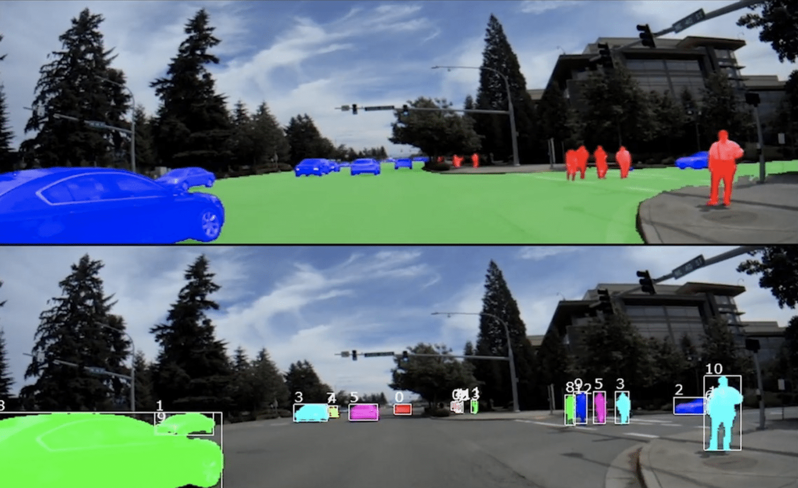

# Car_Localizer
Car localizer made in PyTorch (in developement)

<h1>

PyTorch
 

</h1>

How our project will look
 
<h2>

</h2>

 

## Pre Commit hook installation
https://gdevops.gitlab.io/tuto_git/tools/pre-commit/articles/2018/2018.html

After cloning the repo, type (your local python version should match with language_version defined in pre commit hook):

`> conda install -c conda-forge pre_commit`

`> pre-commit install`
